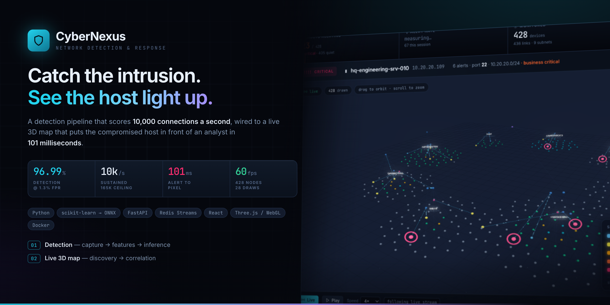

<div align="center">



**[Live demo](https://cybernexus-vert.vercel.app)**&nbsp; ·&nbsp;
[Detection pipeline](stage1/)&nbsp; ·&nbsp;
[Live 3D map](stage2/)&nbsp; ·&nbsp;
[Benchmarks](stage1/BENCHMARK.md)&nbsp; ·&nbsp;
[MTTI study](stage2/MTTI.md)

</div>

# CyberNexus

A platform for real-time detection that watches network activity, flags
suspicious behaviour, and shows it on a live map of the network.

Every number on the cover is measured on a 10-core laptop and reproducible with
the commands in each stage's README. Nothing is estimated.

## Stage 1 — real-time detection pipeline

[`stage1/`](stage1/) turns live connections into scored verdicts: capture, flow
assembly, feature extraction, inference, alerting, with benchmarks and tests.

Measured on a 10-core laptop: **96.99% detection at 1.31% false positives**,
**10,019 connections/s sustained** (ceiling 165k–185k/s), p50 end-to-end latency
8.6 ms.

## Stage 2 — live 3D network map

[`stage2/`](stage2/) discovers the device graph, correlates Stage 1 alerts to
devices, and renders the result in the browser.

Measured on the same machine: **101 ms** from alert to the host being marked on
screen, **60 fps** with 428 nodes in a constant 28 draw calls, and a **50.7%**
modelled reduction in identification time versus a log console (47–54% across
runs) — a model output, with the method and its limits set out in
[stage2/MTTI.md](stage2/MTTI.md).

```bash
cd stage1 && docker compose up --build     # detection pipeline
cd stage2 && docker compose up --build     # map at http://localhost:8080
```

A **backend-free static build** of the map is also available for hosting the UI
on its own (Vercel config is committed at the repository root). It swaps the
transport for an in-browser simulator and labels itself as demo data — see
[stage2/README.md](stage2/README.md#deploying) for what that does and does not
reproduce.

Point both at the same Redis and Stage 2 consumes Stage 1's real alert stream.

| | |
|---|---|
| [stage1/README.md](stage1/README.md) | pipeline quickstart, architecture, configuration |
| [stage1/BENCHMARK.md](stage1/BENCHMARK.md) | measured detection and throughput results |
| [stage2/README.md](stage2/README.md) | map quickstart, discovery, API |
| [stage2/DESIGN.md](stage2/DESIGN.md) | UI rationale and scaling |
| [stage2/MTTI.md](stage2/MTTI.md) | the identification-time experiment |
